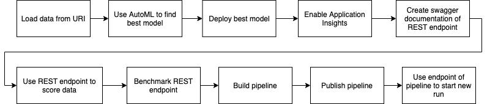

# Operationalizing Machine Learning in Microsoft Azure

This is the second project of the Machine Learning Engineer with Microsoft Azure nanodegree. During this project a classification model is trained using AutoML. The best model is deployed as a Azure Container Instance and the REST endpoint of the deployed model is used to classify new instances. To automate the process of retraining the model, a pipeline is created and published. Using the REST endpoint of this pipeline, everyone with the authentication key is allowed to trigger a new run, for example if new data is available.

This project uses the Bankmarketing dataset (1). This dataset contains personal information from customers of a Portuguese banking institution like the age, the job and information to the last contact to the bank and if the client has subscribed a term deposit. So the banking company wants to find out which customers should be contacted via phone and informed about the term deposit offer.

If you look on the distribution of the binary target (approx. 90 % 'no', 10% 'yes'), you will find out that the dataset is imbalanced. Because of the imbalance of the dataset I will use the _AUC_weighted_ metric to evaluate model performance. The metric _AUC_weighted_ is less influenced by class imbalance than accuracy. Another way to deal with the imbalanced dataset is over- or undersampling the data, which I will describe in more detail in the Further Improvements section.

## Architectural Diagram
In the following I will show the architectural diagram of this project and provide a short description of each step.

First, the data set has to be loaded into Azure Machine Learning Studio. The dataset could be found under the URL 'https://automlsamplenotebookdata.blob.core.windows.net/automl-sample-notebook-data/bankmarketing_train.csv'.

After that I create an AutoML Run to find the best classification model. To create an AutoML run, a dataset and  a compute cluster must be specified. You can perform these step during the creation of a AutoML experiment.

When training of the AutoML run finishes, the best model is deployed. The deployment of models generate an REST endpoint for this model. Using this REST endpoint everyone with the authentication key is allowed to score new data everywhere by sending a HTTP POST request containing the data to be scored in a json string to the model's endpoint. The prediction is returned as a json string.

To obtain more information about our model endpoint and to ease debugging, I enable ApplicationInsights for this endpoint and display its log messages in the console.

As described earlier, the endpoint can be used to obtain predictions for new instances by sending a json string. But we don't know which variables are included in the model. We could use Swagger to obtain this information needed. Swagger provides a documentation of HTTP endpoints with example requests and answers.

Now we know the exact format of a request to the endpoint, so I can try the REST endpoint by using the provided endpoint.py file.

To gain insights about the performance of the endpoint of the model, I use the Apache Benchmark tool. This tool sends multiple requests to the endpoint and measures the response time and the number of failed requests of the endpoint.

The next step is to create a pipeline so you can start a new training over a HTTP request to the pipeline endpoint. This leads to a higher automation and is practical if new data arrive and the model should be retrained based on new data. The pipeline is built in a Jupyter notebook using the Azure SDK in Python.

Publishing the pipeline creates an endpoint of the pipeline. If a HTTP POST request with a json payload containing the experiment name is send to the pipeline endpoint, a new run of the pipeline is triggered.

The last step is to send a request to the pipeline's endpoint and to check whether a new run is started.

## Key Steps
*TODO*: Write a short description of the key steps. Remember to include all the screenshots required to demonstrate key steps.

### Build model endpoint

To reduce manual effort in changing the URI of the endpoint and its key in the endpoint.py and the benchmark.sh scripts, I use a settings.json file, where these information is stored. In the scripts the required URI and key are parsed from the configuration file settings.py. This file also contains the name of the experiment which is used in the logs.py script.

I start by loading the dataset into the Azure Machine Learning Studio. When I loaded the provided lab, this step was already performed.

Next a AutoML run is created. Therefore I have to create a new compute cluster. As a configuration I use a Standard_DS12_v2 machine with 1 as minimum amount of cores and 6 as the maximum number of cores.  After the creation of the target variable has to be set. I choose y as the target. Lastly the type of the experiment has to be chosen. I choose classification because we have a binary target and adjust the following additional settings before creating the ML Run:

- Metric: AUC_weighted
- Exit criterion: 1 hour
- Concurrency: 5

The setting Exit criterion is a timeout for the experiment. It cancels the run if the run isn't completed after 1 hour. The concurrency setting limits the number of parallel runs to 5.

Below you could screenshots of the completed experiment and the best model found by AutoML.

The best model is an ... With ...

The next step is to deploy the best model as an Azure Container Instance which exposes an endpoint which could be used to score new instances. To ensure a secure endpoint, authentication is enabled during the deployment of the best model.

Now I enable ApplicationInsights to get interesting information about the endpoint. These information are helpful when debugging the service. In the screenshots below you can see that ApplicationInsights has been enabled and the endpoint produces logs which are displayed in the terminal output.

To use the endpoint to score new data it is critical to know the structure of the correct payload including the features of the model of the HTTP Post request that is used to score new data. Swagger provides these information to us.

Therefore we need two terminal windows. First, we have to download the swagger.json file from the URL displayed in the Azure Machine Learning Studio. For this step, I used curl in the git bash shell.

Now we run the swagger.sh file using git bash and the swagger UI could be reached on localhost:9000. In the second window, we run the python script serve.py which serves the current directory including the swagger.json file in the browser. As a last step we use the Swagger UI to load the swagger.json file. You could find the documentation of the endpoint of the model provided by Swagger in the screenshots below. These screenshots show all methods of the API of the HTTP endpoint and show example requests and responses.

After the exploration of the model endpoint using Swagger, I want to score some data using a HTTP Post request. By using the documentation provided by Swagger, I know the exact structure of the json payload of the request.
By running the endpoint.py file in python a HTTP Post request containing the data which should be scored as json payload is sent to the endpoint. The endpoint sends a response containing the prediction for each of the instances back to the recipient. The result of this call is shown in the screenshot below.

To check our web service to ease debugging in case of errors and to ensure it works well, I use the Apache benchmarking tool to gain insights about failed requests and the amount of time used to send a response. By running benchmark.sh in the terminal, the benchmark is performed. The results are displayed in the screenshot below.

### Build pipeline endpoint
In this section, a pipeline endpoint is created which could be used to trigger a new run from all over the world using a HTTP POST request.

For example, you could use this endpoint to start a new training whenever new data is available.

I create the pipeline using the Azure ML SDK in the Jupyter Notebook provided by Udacity. In this Jupyter Notebook the input data (Bankmarketing dataset) is loaded from the Workspace and a AutoMLStep is configured and added to the pipeline. The input and output data for the pipeline is also defined.

We use the experiment created earlier to submit the pipeline. Now you can find this pipeline in the pipeline section of Azure ML Studio. In the other screenshot below you could see that the bankmarketing dataset is used by the AutoML module.

After the pipeline run finishes, this pipeline could be  published. This creates a pipeline endpoint, which is displayed in the screenshots below. ACTIVE means that it is possible to send requests to this pipeline endpoint.

Lastly we are able to test the pipeline endpoint by sending a json payload with the Experiment name to the pipeline endpoint. Therefore I use the request module of python. The pipeline endpoint sends a response including the ID for the new run. We look at the details of this new run using the RunDetails widget, which produces the output below

In the same moment the new run is displayed in the section Experiments of the Azure ML Studio as running like you could see in the screenshot below

## Screen Recording
You could find my screencast under https://---

## Further Improvements
In this section I would like to elaborate on further improvements of this project to improve model performance.

The first point I would like to mention is that class imbalance often leads to a lower model performance when the model is tested out-of-sample, because positive instances are rare which leads to a higher number of false negative samples.
It is possible to tackle this deficiency by over- or undersampling the dataset. So the dataset contains the same number of positive and negative examples which will lead to a higher out-of-sample performance.

We could also enable Deep Learning in the AutoML Run settings to use advanced techniques like neural nets to classify the data. These models often have a great performance if you have enough training data.

If we use the parameters blocked models or allowed models we could save some computation time, because we could block models with a higher computational complexity or only try models from whom we know that they perform well in this domain. By using this parameter we also lower computation costs.

Another idea to improve the model performance or the explainability of the model will be feature engineering. This term refers to the creation of new features by transforming and combining features from the dataset or combine features from another dataset within the same domain.

## Resources
(1) Dua, D. and Graff, C. (2019). UCI Machine Learning Repository [http://archive.ics.uci.edu/ml]. Irvine, CA: University of California, School of Information and Computer Science. (https://archive.ics.uci.edu/ml/datasets/Bank+Marketing)
